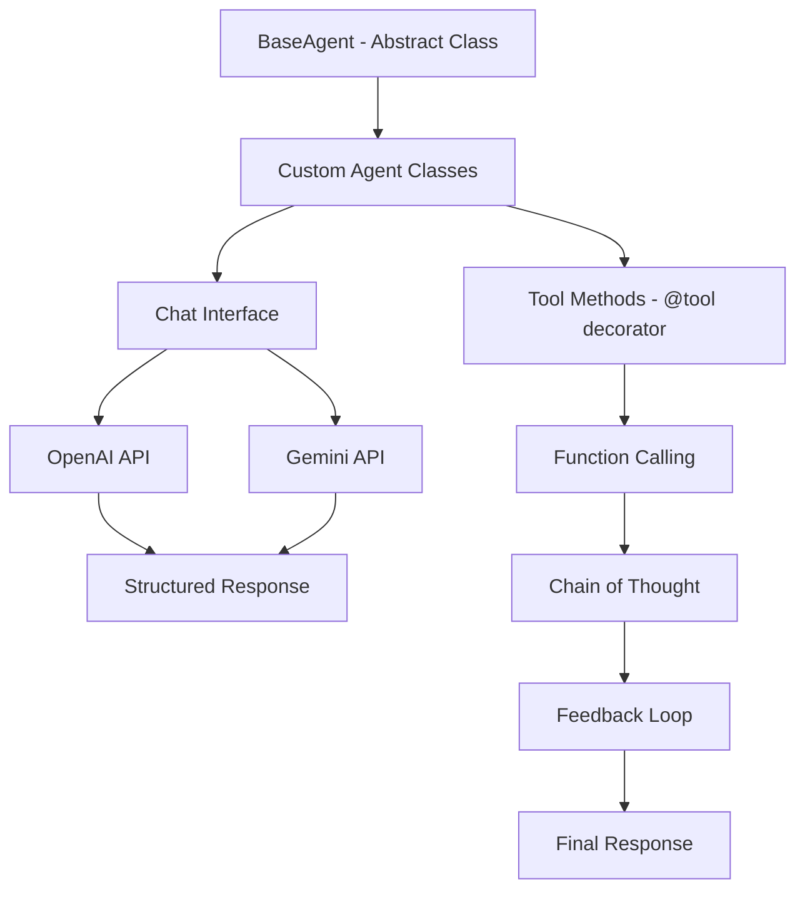
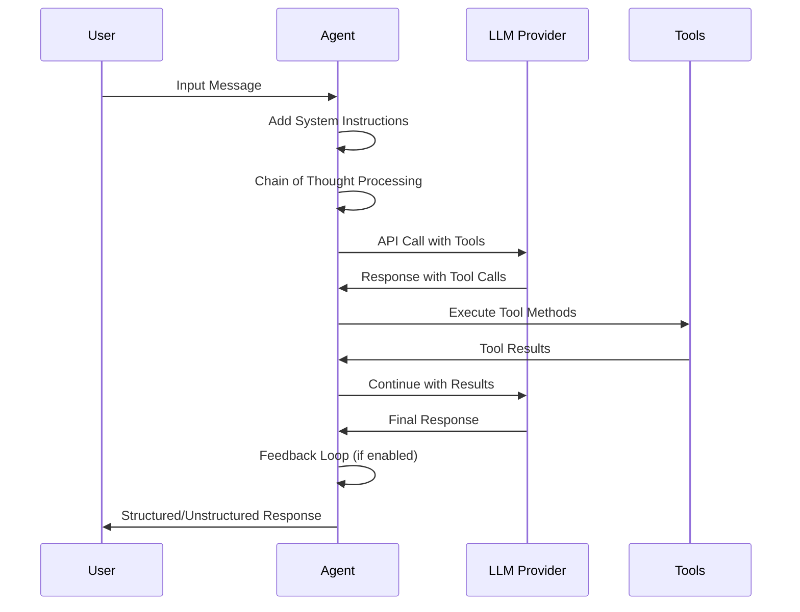
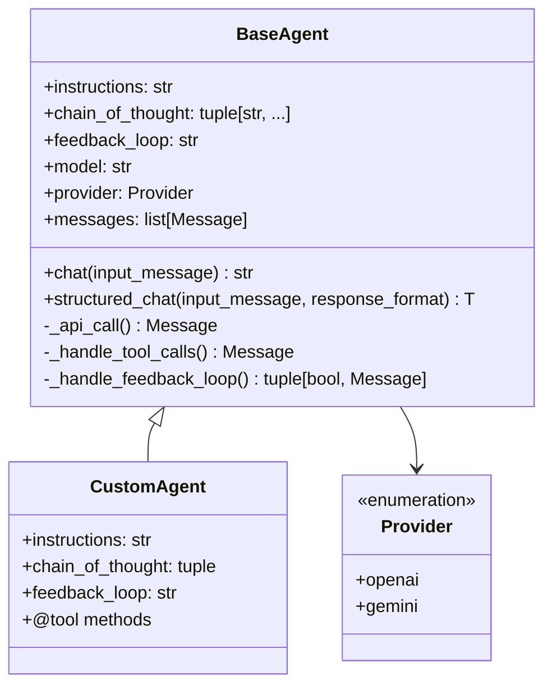

# GitHub Copilot Instructions

## Project Overview

- **Nome do Projeto**: Ironhide
- **Descrição**: OOP LLM agentic framework que simplifica a criação de agentes autônomos de alta qualidade representando-os como classes
- **Versão**: 0.1.11
- **Tecnologias Principais**: Python 3.13+, Pydantic, HTTPX, FastAPI
- **Arquitetura**: Object-Oriented Programming (OOP) com Abstract Base Classes
- **Propósito**: Framework para construção de agentes de IA com capacidades de chat, structured output, chain of thought e feedback loops

## Architecture Overview



## Agent Flow Diagram



## Core Components Structure



## Code Style & Standards

### Python Standards
- **Python Version**: 3.13+
- **Type Checking**: MyPy strict mode enabled
- **Linting**: Ruff with ALL rules enabled (except specific ignores)
- **Code Style**: Strict type hints, Pydantic models
- **Docstring Format**: Google style docstrings

### Naming Conventions
- **Classes**: PascalCase (e.g., `BaseAgent`, `Calculator`)
- **Methods/Functions**: snake_case (e.g., `structured_chat`, `_api_call`)
- **Variables**: snake_case (e.g., `input_message`, `response_format`)
- **Constants**: UPPER_SNAKE_CASE (e.g., `DEFAULT_MODEL`)
- **Private Methods**: Prefix with underscore (e.g., `_handle_tool_calls`)

### Ruff Configuration
```toml
[tool.ruff]
select = ["ALL"]
ignore = [
    "E501",     # line-too-long
    "PLR0913",  # too-many-arguments
    "TD003",    # missing-todo-link
    "TD002",    # missing-todo-author
]
```

## Project Structure

```
ironhide/
├── __init__.py           # Main framework code with BaseAgent
├── models.py             # Provider enum and data models
├── settings.py           # Configuration with pydantic-settings
├── py.typed              # Type hint marker

examples/                 # Example implementations
├── calculator/           # Math operations agent
├── extractor/           # Data extraction agent
└── image/               # Image processing agent
```

## Development Guidelines

### Agent Creation Pattern
```python
class MyAgent(BaseAgent):
    instructions = "Clear system instructions for the agent"
    
    chain_of_thought = (
        "Step 1: Analysis prompt",
        "Step 2: Validation prompt",
    )
    
    feedback_loop = "Evaluation and approval prompt"
    
    def __init__(self, **kwargs):
        super().__init__(**kwargs)
        # Custom initialization
    
    @tool
    def my_tool(
        self,
        param: Annotated[int, "Parameter description"],
    ) -> ReturnType:
        """Tool description for LLM."""
        return result
```

### Tool Method Requirements
- Always use `@tool` decorator
- Include comprehensive docstrings
- Use `typing.Annotated` for parameter descriptions
- Return appropriate types (avoid Any when possible)
- Handle errors gracefully within tools

### Pydantic Model Standards
```python
class ResponseModel(BaseModel):
    """Clear model description."""
    
    field_name: type = Field(
        description="Clear field description",
        # Additional constraints
    )
```

### Async/Await Usage
- All agent methods are async
- Use `await` for all agent interactions
- Prefer async/await over callbacks
- Handle async context properly in tools

## API Integration Patterns

### Chat Methods
```python
# Simple chat
response = await agent.chat("user message")

# Structured chat with validation
response = await agent.structured_chat(
    "user message", 
    response_format=MyModel
)

# With file upload (audio/image)
response = await agent.chat(audio_files, files=image_files)
```

### Provider Configuration
```python
agent = MyAgent(
    model="gpt-4o-mini",
    provider=Provider.openai,
    api_key="your-key"
)
```

## Features Implementation

### Chain of Thought
- Define sequential reasoning steps in `chain_of_thought` tuple
- Each step becomes a system message before tool calling
- Used for complex problem-solving and validation

### Feedback Loop
- Single prompt in `feedback_loop` string
- Evaluates agent's reasoning and tool usage
- Returns approval/rejection with reasoning
- Retry mechanism for rejected responses

### Tool Calling
- Automatic function registration via `@tool` decorator
- JSON schema generation from type hints
- Support for sync and async tool methods
- Parameter validation and description extraction

### Structured Output
- Pydantic model validation
- JSON schema generation with strict mode
- Automatic response parsing and validation
- Error handling for invalid responses

## Error Handling

```python
try:
    response = await agent.structured_chat(message, ResponseModel)
except ValidationError as e:
    # Handle Pydantic validation errors
    pass
except HTTPError as e:
    # Handle API communication errors
    pass
```

## Configuration & Settings

### Environment Variables
```bash
# OpenAI
OPENAI_API_KEY=your-openai-key
OPENAI_MODEL=gpt-4o-mini

# Gemini  
GEMINI_API_KEY=your-gemini-key
GEMINI_MODEL=gemini-2.5-flash-preview-05-20

# General
DEFAULT_PROVIDER=openai
LOG_LEVEL=INFO
REQUEST_TIMEOUT=30
```

### Settings Class Usage
```python
from ironhide.settings import settings

# Access configuration
model = settings.default_model
timeout = settings.request_timeout
```

## Testing Guidelines

### Example Structure
```python
import pytest
from ironhide import BaseAgent, tool

class TestAgent(BaseAgent):
    instructions = "Test agent"
    
    @tool
    def test_tool(self, value: int) -> int:
        return value * 2

@pytest.mark.asyncio
async def test_agent_functionality():
    agent = TestAgent()
    result = await agent.chat("test message")
    assert result is not None
```

## Security Considerations

- Never commit API keys to version control
- Use environment variables for sensitive data
- Validate all user inputs in tool methods
- Implement proper error handling to avoid information leakage
- Consider rate limiting for production deployments

## Performance Guidelines

- Use async/await consistently
- Implement connection pooling via HTTPX client
- Cache agent instances when possible
- Monitor token usage and API costs
- Consider streaming responses for long outputs

## Dependencies

### Core Dependencies
```toml
dependencies = [
    "pydantic>=2.10.5",
    "pydantic-settings>=2.7.1", 
    "httpx>=0.28.1"
]
```

### Development Dependencies
```toml
dev-dependencies = [
    "mypy>=1.14.1",
    "ruff>=0.9.3"
]
```

## Common Patterns

### FastAPI Integration
```python
from fastapi import FastAPI
from ironhide import BaseAgent

app = FastAPI()
agent = MyAgent()

@app.post("/chat")
async def chat_endpoint(request: RequestModel) -> ResponseModel:
    return await agent.structured_chat(
        request.content, 
        response_format=ResponseModel
    )
```

### Multi-Provider Support
```python
# Easy provider switching
openai_agent = MyAgent(provider=Provider.openai)
gemini_agent = MyAgent(provider=Provider.gemini)
```

## Best Practices

1. **Agent Design**: Keep instructions clear and specific
2. **Tool Methods**: Make them focused and single-purpose
3. **Error Handling**: Always handle API failures gracefully
4. **Type Safety**: Use strict typing throughout
5. **Documentation**: Document all public methods and classes
6. **Testing**: Write tests for custom agents and tools
7. **Configuration**: Use environment variables for deployment settings
8. **Logging**: Enable appropriate logging levels for debugging

## Framework Philosophy

Ironhide follows the principle of **"Agents as Classes"** - representing AI agents as Python classes with:
- Clear inheritance hierarchy
- Tool methods as class methods
- Configuration as class attributes
- State management through instance variables
- Type safety through Pydantic integration

This approach provides better code organization, reusability, and maintainability compared to functional approaches.
